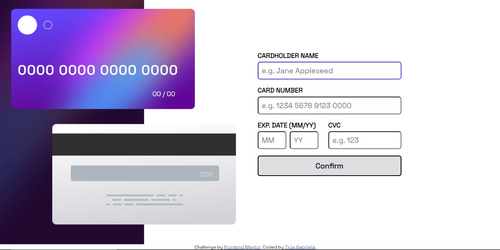
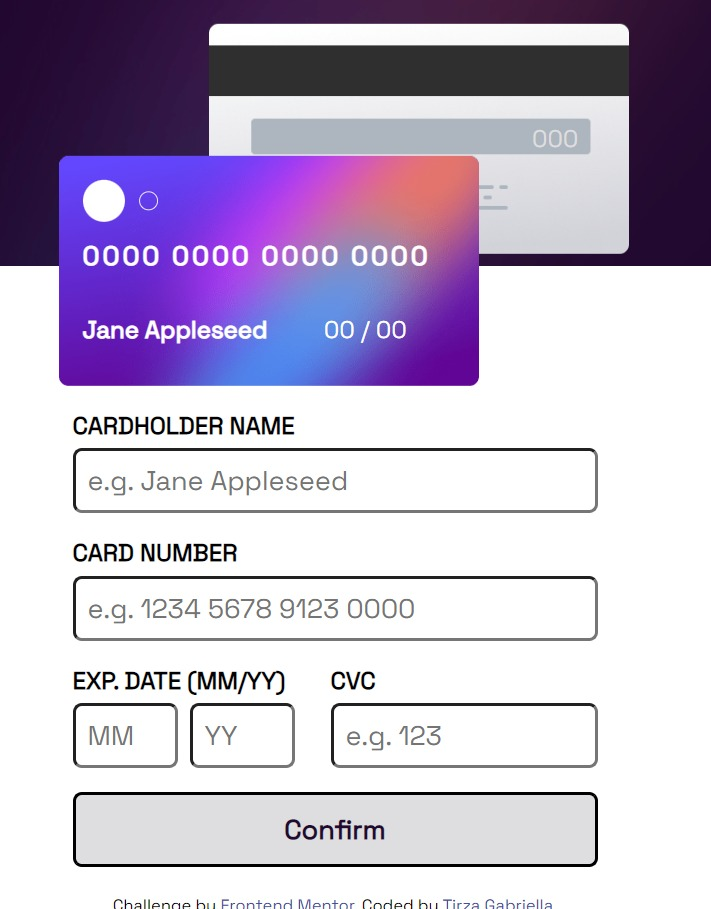

# Quiz 2 - Interactive card detail solution

This is a solution to the [Interactive card detail page Quiz 2 challenge]

## Table of contents

- [Overview](#overview)
  - [The challenge](#the-challenge)
  - [Screenshot](#screenshot)
  - [Links](#links)
- [My process](#my-process)
  - [Built with](#built-with)
  - [What I learned](#what-i-learned)
  - [Continued development](#continued-development)
  - [Useful resources](#useful-resources)
- [Author](#author)

## Overview

### The challenge

Users should be able to:

- Fill in the form and see the card details update in real-time
- Receive error messages when the form is submitted if:
  - Any input field is empty
  - The card number, expiry date, or CVC fields are in the wrong format
- View the optimal layout depending on their device's screen size
- See hover, active, and focus states for interactive elements on the page

### Screenshot

### Links

- Solution URL: [solution](https://github.com/tirzagabriella/interactive-card-details-form)
- Live Site URL: [live site]()

## My process

### Built with

- Vscode
- HTML
- CSS
- Flexbox
- Javascript

### What I learned

I've learned to used html, flexbox, css and java. Also learned how to make a website interactive. 

### Continued development

I'm still struggling in javascript. So still need many practice in that area.

### Useful resources
There are many useful resources from the internet, but Geeks4Geeks and W3Schools helps the most. 

## Your Detail 

- FullName - Tirza Gabriella
- StudentID - 2602109870
- BINUS Email - tirza.gabriella001@binus.ac.id

